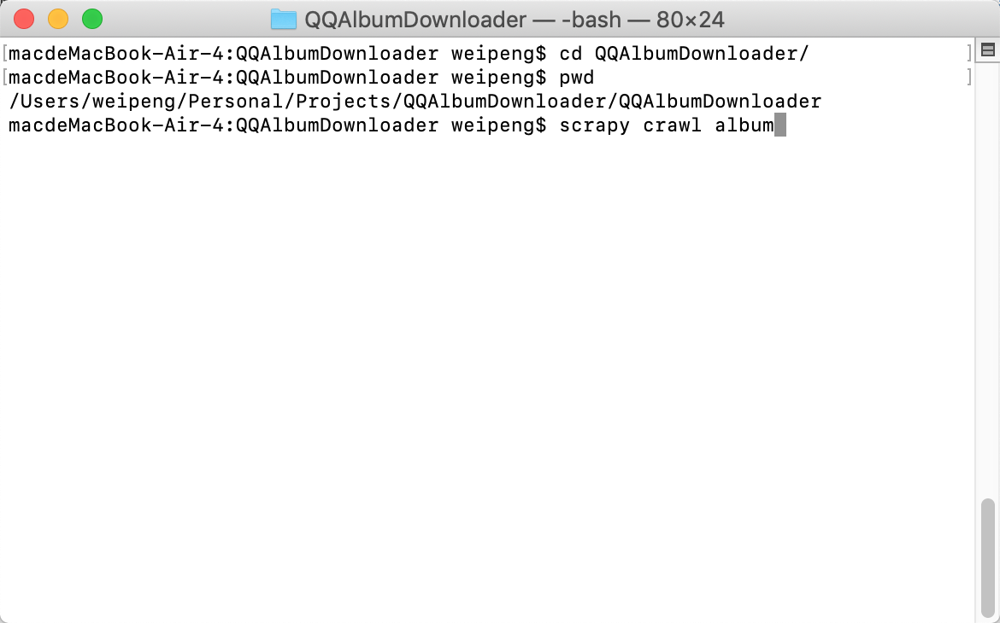

# QQAlbumDownloader
## 1、概述
这个项目是一个 QQ 空间中的照片下载器，用于一次性下载 QQ 空间相册中的所有照片。
## 2、项目架构
这个项目使用 ```python```语言开发完成，基于```scrapy```j框架，从而使程序的运行更加高效。
## 3、使用方法
a、下载谷歌浏览器并安装，下载地址为：https://www.google.cn/chrome/
b、查看谷歌浏览器版本信息

<video src="movie/QQ20190527-184137-HD.mp4"></video>

c、下载对应版本的 ```webdriver```，然后放到项目中的webdriver目录下，下载地址为：https://chromedriver.storage.googleapis.com/index.html


d、下载并安装```python(3.7)```

e、安装```scrapy```框架，具体可参考博客：https://blog.csdn.net/zer021/article/details/80659157

f、进入到项目根目录下的```QQAlbumDownloader```文件夹下，使用```scrapy crawl album```便可运行程序



g、运行效果

